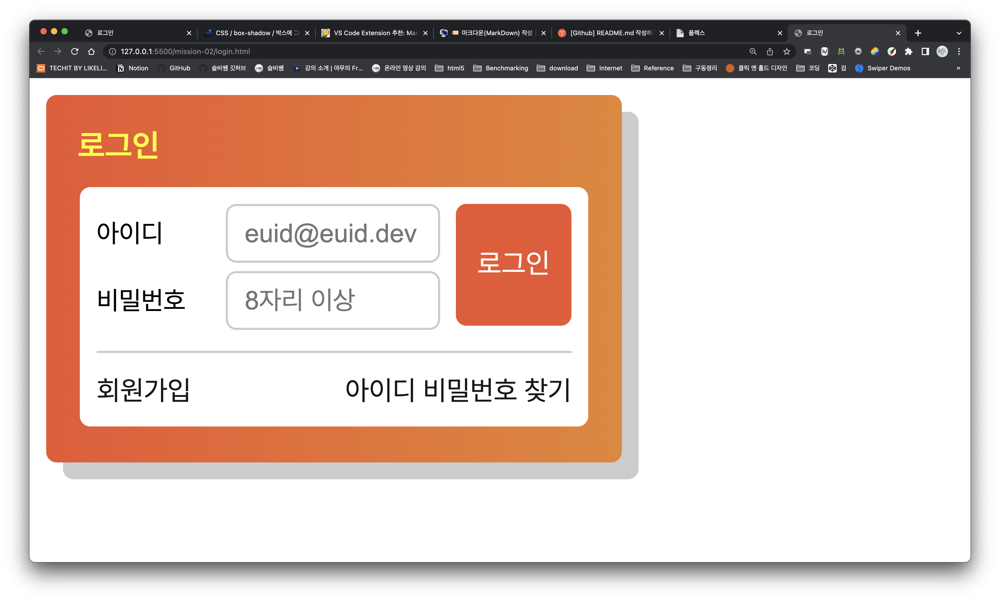

<!-- heading -->
# html
</br>

<!-- Quote -->
> 아이디 input 마크업

```html
<div>
  <label>아이디</label>
  <input class="input_01" type="text" name="userName" placeholder="euid@euid.dev">
</div>
```

- `<label>` 태그를 이용하여 인풋박스 옆 텍스트 표현
- "*placeholder*"를 이용하여 인풋안에 텍스트 삽입 

</br>
</br>

> 비밀번호 input 마크업

```html
<div>
  <label>비밀번호</label>
  <input class="input_02" type="password" name="password" placeholder="8자리 이상">
</div>
```

- `<label>` 태그를 이용하여 인풋박스 옆 텍스트 표현
- "*type*"에 비밀번호 사용함을 명시함 
- "*placeholder*"를 이용하여 인풋안에 텍스트 삽입 

</br>
</br>

> 버튼 디자인

```html
<button id="btn" type="button">로그인</button>
```

</br>
</br>

> 버튼 디자인

```html
<ul class="join">
  <li>
    회원가입
  </li>
  <li>
    아이디 비밀번호 찾기
  </li>
</ul>
```

- `<ul>`태그를 이용하여 배치에 용이하도록 마크업

</br>
</br>
</br>

<!-- heading -->
# css
</br>

<!-- Quote -->
> 제일 큰 orange color 배경을 만들기 위한 css

```css
.container {
  width: 244px;
  height: 145px;
  background: linear-gradient(90deg, #ED552F, #E8852E);
  border-radius: 5px;
  padding: 15px;
  box-shadow: 8px 8px #ccc;
}
```

- *width, height*로 박스 전체크기 지정
- *linear-gradient*로 그라디언트 표현
- *border-radius* 박스 모서리 둥글게 만들기
- 상,하가 동일하게 가지는 안쪽 여백 *padding*으로 밀기
 

</br>
</br>


> 안쪽 흰색 배경 만들기

```css
.wrap {
  width: 226px;
  height: 98px;
  background-color: #fff;
  border-radius: 5px;
  padding: 8px;
  margin: auto;
}
```

- *margin:auto;*를 이용해서 박스 정중앙에 배치시키기

</br>
</br>


> 에이전트가 제공하는 li의 스타일 없애기

```css
.container li {
  list-style-type: none;
  margin-left: -40px;
}
```

- *list-style-type: none*를 이용해서 li가 갖는 기본 스타일 없애기
- *margin-left: -40px*를 이용해서 에이전트가 제공하는 li의 마진값 빼주기

</br>
</br>


> 포지션 배치를 위한 기준값 부여하기

```css
#login-form {
  border-bottom: 1px solid #ccc;
  font-weight: 400;
  font-size: 0.875em;
  position: relative;
}
```

</br>
</br>


> 버튼 디자인 & 배치하기

```css
#btn {
  width: 55px;
  height: 58px;
  border-radius: 5px;
  color: #fff;
  background-color: #ED552F;
  border: none;
  font-weight: 400;
  padding: 5px;
  position: absolute;
  right: 0;
  top: 0;
}
```

- 기준으로 잡은 #login-form기준 *right:0*과 *top:0* 사용하여 버튼 배치하기
- 에이전트가 기본으로 제공하는 스타일 (border)값 none주고, 디자인 커스텀하기
 

</br>
</br>


> 인풋박스 상하 배치를 위한 속성

```css
#login-form label {
  width: 58px;
  display: inline-block;
  font-size: 0.875em;
}
```

- *display: inline-block* 사용하여 인풋박스 나란히 배치
 
</br>
</br>


> 회원가입, 아이디 비밀번호 찾기 배치

```css
.join li:first-child {
  float: left;
}

.join li:last-child {
  float: right;
}
```

</br>
</br>

---

</br>
</br>

<!-- Quote -->
## 결과화면

<!-- Image -->

