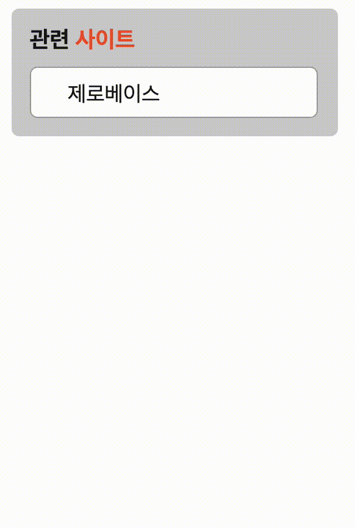

# html

> 마크업

```html
  <div class="container">
    <h1>관련 <span>사이트</span></h1>
    <ul class="wrap">
      <li class="first-txt">제로베이스</li>
      <li>MDN</li>
      <li>웹접근성 연구소</li>
      <li>Web Standards</li>
      <li>W3C</li>
    </ul>
  </div>
```

- h1태그를 사용하여 제목을 지정
- span태그를 이용하여 따로 css를 넣을 수 있게 마크업
- ul과 li 태그를 이용하여 리스트 작성
- 전체 상자를 스타일링하기위한 container로 전체 묶어주기

</br>
</br>

---

</br>
</br>

# css

</br>

>스타일링을 위한 css
</br>

``` css
.container {
  width: 190px;
  background-color: #cfcfcf;
  border-radius: 5px;
  color: #181818;
  padding: 12px;
}

h1 {
  font-weight: 700;
  font-size: 0.9375em;
  margin: 0 0 8px 0;
}

.container span {
  color: #ED552F;
}

.wrap {
  width: 187px;
  height: 29px;
  padding-top: 3px;
  background-color: #fff;
  border-radius: 5px;
  border: 1px solid #a3a3a3;
  padding-left: 0;
  margin: 0;
}

.wrap li {
  list-style: none;
  font-weight: 400;
  font-size: 0.875em;
  margin-left: 24px;
}

.wrap li:first-child {
  margin-top: 6px;
}

.wrap li:nth-child(-n+4) {
  margin-bottom: 8px;
}

.wrap li:last-child {
  margin-bottom: 6px;
}

```

1. 전체 박스 사이즈 및 컬러 지정하기
2. h1 태그에 있는 tilte 꾸며주기, span태그 따로 색상 지정해주기
3. ul태그 상자의 배경과 스타일링주기
4. 에이전트에서 제공하는 스타일을 제거하기위해 li에 왼쪽 마진값고, 스타일 none값 부여
5. li들의 공백값 지정
6. 첫번째 li의 윗 간격과 마지막 li의 아래간격 따로 지정

</br>
</br>
</br>

>인터랙션 구현을 위한 css
</br>

```css
.wrap {
  overflow: hidden;
  transition: padding-top 2s 0.5s, height 1s;
}

.wrap:hover {
  width: 187px;
  height: 137px;
  padding-top: 10px;
}

```
1. 가상클래스 :hover를 사용하여 hover시에 보여질 비주얼대로 코딩
2. 전체 상자가 작아졌을 때, ul 기준으로 텍스트가 넘치지 않게하기위해 overflow:hidden 부여
3. transition을 이용하여 패딩값과 높이값의 시간차를 줌

  </br>
  </br>
  </br>

---
  </br>

# 결과물




