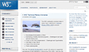
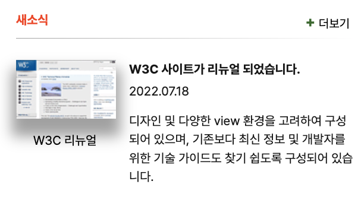

# html

>마크업

```html
  <div class="wrap">
    <div class="top">
      <h2>새소식</h2>
      <button type="button"><strong> + </strong> 더보기</button>
    </div>
    <div class="img-box">
      
      <span>W3C 리뉴얼</span>
    </div>
    <ul class="txt-box">
      <li>
        <a href="/" target="_blank" noopner noreferrer>W3C 사이트가 리뉴얼 되었습니다.</a>
      </li>
      <li>
       <a href="/" target="_blank" noopner noreferrer>2022.07.18</a>
      </li>
      <li>
        <a href="/" target="_blank" noopner noreferrer>디자인 및 다양한 view 환경을 고려하여 구성되어 있으며, 기존보다 최신 정보 및 개발자를 위한 기술 가이드도 찾기 쉽도록 구성되어 있습니다.</a>
      </li>
    </ul>
  </div>
```
</br>
1. 그리드로 구성할 수 있는 덩어리 생각하기</p>
2. 그라디언트 stroke를 위해 새소식, 더보기 div로 묶기</p>
3. 이미지와 이미지 타이틀 한덩어리로 묶기</p>
4. 텍스트 한덩어리로 묶고, 선택될 수 있게 a태그 이용하기

</br>
</br>
</br>

---
</br>
</br>

# css

> 폰트지정
```css
body {
  font-family: "Pretendard Variable", Pretendard, -apple-system,
    BlinkMacSystemFont, system-ui, Roboto, "Helvetica Neue", "Segoe UI",
    "Apple SD Gothic Neo", "Noto Sans KR", "Malgun Gothic", "Apple Color Emoji",
    "Segoe UI Emoji", "Segoe UI Symbol", sans-serif;
  padding: 30px;
}
```
</br>
</br>
</br>
</br>

>이번 과제에서 새롭게 다룬 css

```css
.top {
  border-bottom: 1px solid;
  border-image:linear-gradient(09deg, #a9a9a9 0%, white 60%);
  border-image-slice: 1;
}
```

- storke에 gradient 주기 : border:image 사용

</br>
</br> 
</br>
</br> 

> 스타일 지정을 위한 css

```css
.wrap {
  width: 380px;
}

.top {
  border-bottom: 1px solid;
  border-image: linear-gradient(09deg, #a9a9a9 0%, white 60%);
  border-image-slice: 1;
  margin-bottom: 24px;
}

h2 {
  color: #ED552F;
  font-size: 0.875em;
  font-weight: 700;
}

button {
  font-size: 0.875;
  border: none;
  background: none;
  top: 12px;
  right: 0;
}

strong {
  color: #447231;
  font-size: 1.25em;
  font-weight: 700;
}

.img-box {
  text-align: center;
  margin-right: 17px;
  height: 120px;
}

img {
  margin: 0 0 10px;
  box-shadow: 0 15px 15px 5px #AAA;
}

span {
  font-size: 0.875em;
}

.txt-box {
  list-style: none;
  padding: 0;
  height: 120px;
  margin-top: 0;
}

a {
  text-decoration: none;
  color: inherit;
}

li {
  color: #181818;
  font-weight: 400;
  font-size: 0.875em;
  line-height: 150%;
}

li:first-child {
  font-size: 0.875em;
  font-weight: 700;
  margin-bottom: 4px;
}

li:nth-child(2) {
  margin-bottom: 12px;
}
```
1. 각 텍스트 별 사이즈와 컬러 지정해주기
2. 이미지 box-shadow 사용하여 그림자주기
3. 에이전트에서 지정해준 a태그 스타일 제외하기 (text-decoration: none;)
4. li들 사이 간격 맞추기

</br>
</br> 
</br>
</br> 

> 배치를 위한 css

```css

.wrap {
  display: grid;
  grid-template-columns: repeat(6, 1fr);
  grid-template-rows: auto;
  grid-template-areas: 
  "top top top top top top"
  "img-box img-box txt-box txt-box txt-box txt-box" ;
}

.top {
  grid-area: top;
  position: relative;
}

h2 {
  grid-area: h2;
}

button {
  grid-area: button;
  position: absolute;
  top: 12px;
  right: 0;
}

.img-box {
  grid-area: img-box;
}

.txt-box {
  grid-area: txt-box;

}

```
1. 새소식, 더보기버튼을 배치하기 위해 포지션으로 배치
2. 각 태그에게 grid-area를 활용하여 이름 지정
3. 그리드를 활용하여 비율에 맞게 배치


</br>
</br>

---

</br>
</br>

## 결과화면

</br>

<!-- Image -->

