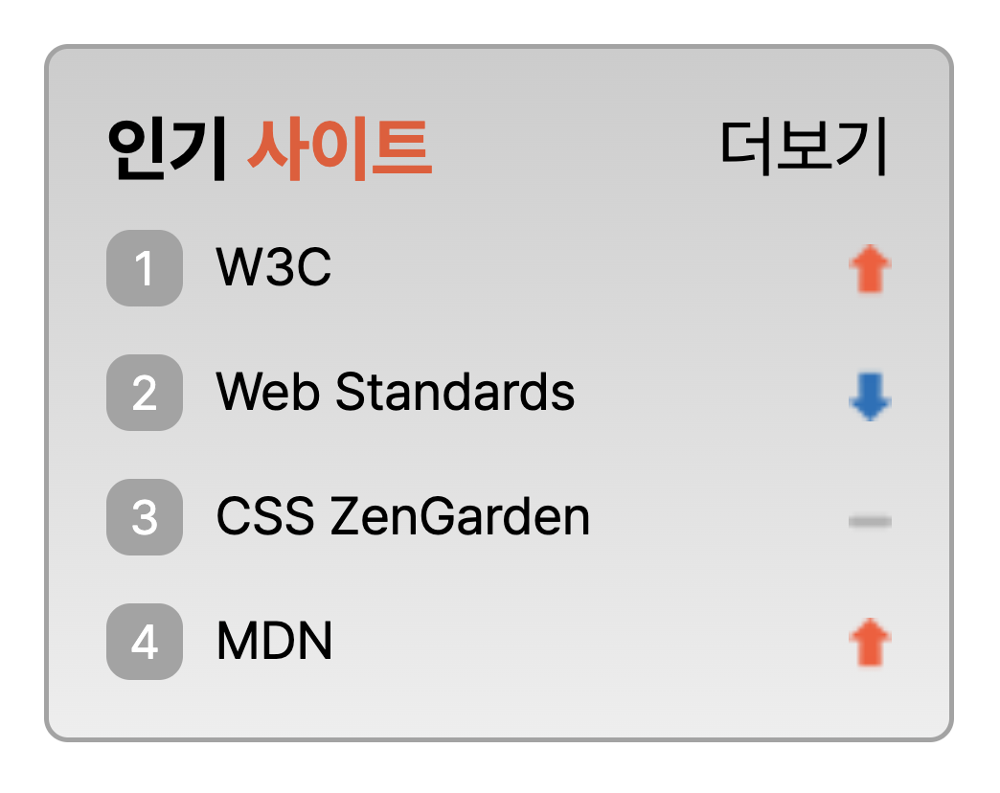

# html

> 레이아웃을 위한 마크업

```html
<div class="wrap">
    <div class="top">
      <h2>인기 <span class="color">사이트</span></h2>
      <span class="more">더보기</span>
    </div>
    <ol>
      <li class="one_sprite sprite">
        <a href="">
          <span class="number">1</span>
          <span class="txt">W3C</span>
        </a>
      </li>
    </ol>
</div>
```

1. 전체 "wrap"으로 감싸주어 배경에 css를 줄 수 있도록 설계
2. 컬러가 다른 부분에 다른 속성을 주기위해 "span" 태크로 별도 그룹핑
3. 순위를 표시하는 "ol"태그를 이용하여 list 마크업

</br>
</br>

---

# CSS

> 디자인

```css

.wrap {
  width: 190px;
  background: linear-gradient(180deg, #ccc, #eee);
  border-radius: 5px;
  border: 1px solid #a3a3a3;
  padding: 12px;
  box-sizing: border-box;
}

h2 {
  margin: 0;
  font-size: 0.9375em;
  font-weight: 700;
  margin-bottom: 8px;
}

.top {
  position: relative;
}

.color {
  color: #ED552F;
}

.more {
  font-size: 0.875em;
  position: absolute;
  right: 0;
  top: 0;
}

ol {
  padding-left: 0;
  margin: 0;
}

.number {
  text-align: center;
  display: inline-block;
  width: 16px;
  border-radius: 5px;
  background: #a3a3a3;
  color: #fff;
  font-size: 0.6875em;
  padding: 2px 0;
}

a {
  text-decoration: none;
  color: inherit;
  display: block;
}

.sprite {
  list-style: none;
  font-size: 0.6875em;
  background-image: url(./images/rank.png);
  background-repeat: no-repeat;
  margin-bottom: 10px;
}

.txt {
  margin-left: 4px;
}

.one_sprite {
  background-position: right 3px;
}

.two_sprite {
  background-position: right -41px;
}

.three_sprite {
  background-position: right -18px;
}

.four_sprite {
  background-position: right 3px;
  margin-bottom: 0;
}

```

1. 박스 width 크기값 지정 및 background, border 지정
2. tilte 텍스트 지정, 컬러 다른 부분 속성 따로 주기
3. 더보기 txt 스타일 지정, position으로 자리 잡기
4. ol의 불릿 list-style:none;을 이용하여 삭제
5. 클래스 number에 넘버링 커스텀 디자인 입히기
6. 컨텐츠들 간격 설정하기
7. 리스트의 전체가 클릭될 수 있도록, a 태그에 display:block 부여

</br>
</br>

> sprite 사용해보기

1. "background-image: url" 를 이용하여, 이미지 넣어주기
2. 이미지가 반복되지않도록 "background-repeat: no-repeat;" 사용하기
3. 각각의 클래스에 "background-position"이용하여 이미지 위치 찾아주기

</br>
</br>

---

</br>

## 결과화면

</br>
</br>

<!-- Image -->
